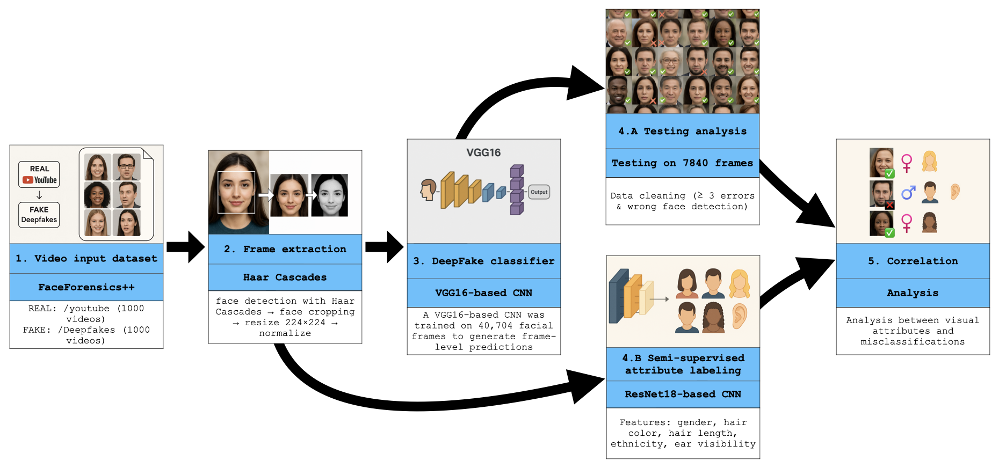

# deepfake-attribute-detection
Repository for replicating the experiments described in the article: "Enhancing DeepFake Detection with Semi-Supervised Facial Attribute Labeling: A Hybrid Learning Approach". Developed as part of the joint research between Universitas Mercatorum and Universidad de Cádiz (UCA).

## 🧠 Project Summary

This research investigates the integration of automatically labeled visual attributes—such as gender, hair color, and ear visibility—into CNN-based DeepFake detection models. We combine a semi-supervised labeling pipeline with a deep learning classifier to improve detection performance and interpretability. All experiments are conducted on a curated subset of the FaceForensics++ dataset.

---

## 🧪 What's Included in This Repository

- ✅ **Source Code** to preprocess video data, extract facial frames, and apply visual attribute auto-labeling.
- ✅ **Trained Model Checkpoint** (VGG16-based), fine-tuned for DeepFake classification using both images and auxiliary labels.
- ✅ **FaceForensics++ Data Subset**: Selection of 8,000 cropped frames (4000 REAL/4000 FAKE) preprocessed and organized for replication.
- ✅ **Jupyter Notebooks** and scripts for:
  - Face extraction using OpenCV Haar Cascade
  - Semi-supervised labeling
  - Model training and evaluation
  - Bias and error analysis

---

## 🔍 Methodology Overview

1. **Frame Extraction**  
   Extract 1 frame every 20 using OpenCV from compressed (C40) FaceForensics++ videos.
2. **Face Detection**  
   Apply Haar Cascades to crop and normalize faces to 224x224.
3. **Semi-Supervised Labeling**  
   Automatically label 95% of samples using a classifier trained on 5% manually annotated data.
4. **Model Training**  
   Train a hybrid VGG16-based binary classifier combining visual data and attribute vectors.
5. **Evaluation**  
   Metrics include accuracy, precision, recall, F1-score, and error analysis via false positives/negatives.



> [!NOTE]
> Overview of the proposed methodology. The pipeline begins with video-level
input from the FaceForensics++ dataset, proceeds through frame extraction and face cropping,
followed by DeepFake classification at the frame level. A semi-supervised labeling process
is then used to annotate facial attributes, and finally, correlations between those attributes
and misclassification patterns are analyzed.

---

## 📊 Key Results

The hybrid model incorporating attribute labels showed improved robustness and interpretability, particularly in challenging scenarios (e.g., frontal lighting, uncovered ears). Role-sensitive bias analysis highlighted dependencies on specific visual configurations.

---

## 🏛 Collaborations

- **Universidad de Cádiz (UCA)**  
  Development of the semi-supervised labeling system and error analysis.

- **Universitas Mercatorum (Rome)**  
  Design of the DeepFake detection pipeline and academic dissemination.

---

## 📂 Repository Structure

```
LICENSE
README.md

/dataset/
 ├── youtube/
 ├── DeepFakes/
 └── attribute/
		├── auto-labeling/
		└── ground-truth/
 				├── attribute-info.txt
				└── attribute-youtube.csv

/saved-models/
 ├── YYYY-MM-GG/
 ├── ...
 └── YYYY-MM-GG/
 		├── vgg16-hybrid-checkpoint.keras.zip.001
 		└── vgg16-hybrid-checkpoint.keras.zip.002

/notebooks/
 ├── DeepFace_Detect_0.1.1_ResNet-50.ipynb
 ├── DeepFace_Detect_0.1.2_ResNet-50.ipynb
 ├── ...
 ├── ... .ipynb
 └── dataset-preprocessing/
		├── file-manipulation/
		└── frame-estraction/
                ├── data-preparation.ipynb
                ├── ...
                └── ... .ipynb

 
/results/
 ├── YYYY-MM-GG/
 ├── ...
 └── YYYY-MM-GG/
  		├── file...01.csv
		├── file...02.csv
		├── ...
  		└── file...99.csv
 
/setup-instruction/
 ├── environment-setup/
 └── download-faceforensics++/
 		├── download-FaceForensics++.py
 		└── download-FaceForensics++guide.pdf
 
```

---

## 🛠 Technologies Used

- **Python 3.10**
- **TensorFlow / Keras**
- **OpenCV**
- **scikit-learn, NumPy, Pandas**
- **Matplotlib, Seaborn**

---

## 📄 Citation

If you use this code or data in your research, please cite:

> Vittorio Stile, Roberto Caldelli, Gabriel Guerrero-Contreras, Sara Balderas-Díaz, Inmaculada Medina-Bulo,  
> _Analysis of DeepFake Detection through Semi-Supervised Facial Attribute Labeling_. The 11th Spanish-German Symposium on Applied Computer Science (SGSOACS), Vienna, Austria 2025, June 2.

---

## 📢 Acknowledgments

This work was supported by the European Union under D.M. n. 352/2022 and PwC Business Services SRL. Special thanks to the research teams at UCA and Universitas Mercatorum for their continued collaboration.

---

## Privacy and reuse policy

* This repository contains code and models. No personal data are included.
* **Reuse is permitted provided that you cite the author and this work.**
* Recommended license: **Creative Commons Attribution 4.0 International (CC BY 4.0)**. You are free to share and adapt the material for any purpose, even commercially, as long as appropriate credit is given, a link to the license is provided, and any changes are indicated.

Short attribution text you can include in derivative works:

```
This material reuses data and methods from this work:
Stile, V. (2025). Deepfake Attribute Detection – A Project on Attribute-Aware Detection and Bias Analysis.
GitHub repository, https://github.com/vstile/deepfake-attribute-detection
© 2025 Vittorio Stile - Licensed under CC BY 4.0.
```

or
```
This material reuses data and methods from this paper:
Stile, V., Caldelli, R., Guerrero-Contreras, G., Balderas-Díaz, S., and Medina-Bulo, I. (2025). Analysis of DeepFake Detection through Semi-Supervised Facial Attribute Labeling. Proceedings of the 11th Spanish-German Symposium on Applied Computer Science (SGSOACS 2025), 2831, XX, 138. https://link.springer.com/book/9783032148155
© 2025 Vittorio Stile - Licensed under CC BY 4.0.
```

or
```
This material reuses data and methods from this Ph.D. Dissertation:
Stile, V. (2025). “AI-generated Deepfakes: A Study on Attribute-Aware Detection, Bias Analysis, and Generalisation” Ph.D. dissertation, Universitas Mercatorum, Roma.
© 2025 Vittorio Stile - Licensed under CC BY 4.0.
```

